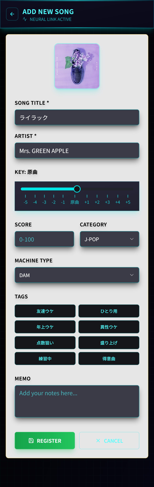
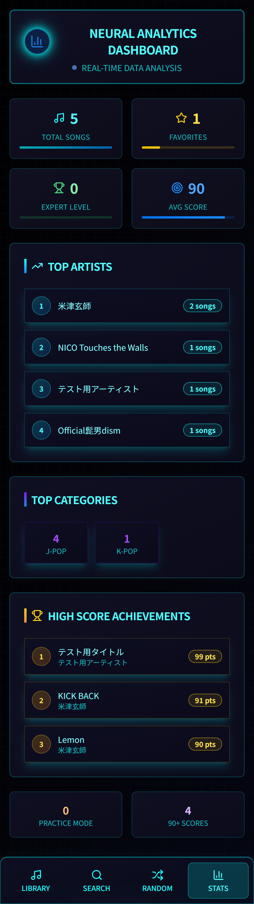

# 🎵 SongRepertorie

カラオケのレパートリーを管理できるアプリです。  
キー調整・スコア・タグ・メモなどを登録し、スマホUIで快適に操作できます。

---

## 📌 プロジェクト概要

- 自分のカラオケ曲を登録・管理できるWebアプリ
- 曲情報（タイトル・アーティスト・キー・得点・メモ・タグなど）を保存
- お気に入り機能やタグ管理で分類しやすい
- モバイルUI対応（スマホ画面を想定）

---

## 🎯 作成目的・背景

- 自分自身のカラオケのレパートリーを把握するため
- キーや得点、メモを記録して自己管理できるようにしたかった
- ポートフォリオとして、フロントエンド（Next.js）とバックエンド（Spring Boot）の連携を学ぶために作成

---

## ✨ 主な機能

- 曲の登録・編集・削除
- 曲ごとのタグ管理（多対多）
- キー・スコア・メモの入力
- お気に入り機能（☆）
- モバイル対応のUI（ナビゲーションバー）
- 統計画面（カテゴリ別・アーティスト別・平均スコア）

---

## 🖼️ スクリーンショット

<div align="center">
  <table>
    <tr>
      <td width="50%" align="center">
        <h4>サインイン画面</h4>
        <br>
        <p style="font-size: 14px;">
          "USER ID"：メールアドレス<br>
          "ACCESS CODE"：パスワード<br>
          サインアップは<br>
          CREATE NEW ACCOUNTから
        </p>
      </td>
      <td width="50%" align="center">
        <h4>ホーム画面</h4>
        <br>
        <p style="font-size: 14px;">
          登録済みの曲の一覧・サマリを表示<br>
          フィルター/ソート/検索機能有り<br>
          <br> <!-- 高さ調整 -->
          <br> <!-- 高さ調整 -->
        </p>
      </td>
    </tr>
    <tr>
      <td width="50%" align="center">
        <h4>登録フォーム</h4>
        <br>
        <p style="font-size: 14px;">
          キーやカテゴリなどを記載可能<br>
          検索からの追加、手動での追加にも対応<br>
          <br> <!-- 高さ調整 -->
        </p>
      </td>
      <td width="50%" align="center">
        <h4>統計画面</h4>
        <br>
        <p style="font-size: 14px;">
          登録されている曲の<br>
          各種統計データを閲覧可能<br>
          <br> <!-- 高さ調整 -->
        </p>
      </td>
    </tr>
  </table>
</div>


---

## 🏗️ 使用技術

### フロントエンド
- React / Next.js (App Router)
- TypeScript
- Tailwind CSS
- Axios

### バックエンド
- Java / Spring Boot
- Spring Data JPA
- REST API設計
- MySQL

### その他
- Git / GitHub
- Render（バックエンド）
- Vercel（フロントエンド）

---

## 📁 ディレクトリ構成

```bash
SongRepertorie/
├── backend/           # Spring Boot (APIサーバー)
└── frontend/          
    └── my-next-app/   # Next.js + Tailwind CSS (UI)
